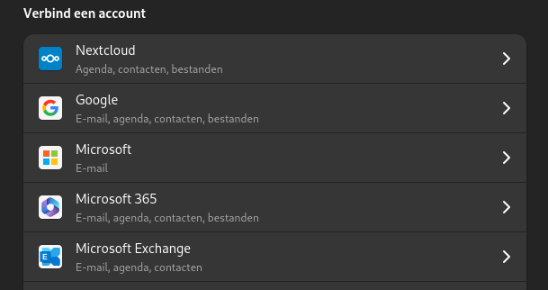
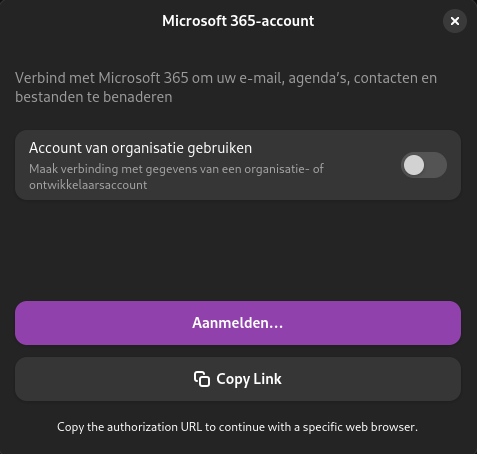
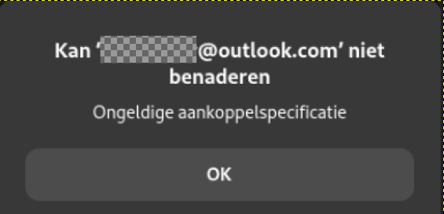

Eerlijk is eerlijk: ik was best tevreden met Windows. Maar ik erger me steeds meer aan de opdringerige en stiekeme manier waarop Microsoft je hun ecosysteem in duwt. Ik zette per ongeluk Copilot aan, en jeetje, wat is dat irritant. Het deed me denken aan hun beruchte Clippy.


Toen er op YouTube steeds vaker video's over Linux voorbijkwamen, dacht ik: waarom niet?

## Beginnen met Linux

Heb je Linux nog nooit geprobeerd? Dan raad ik **Linux Mint Cinnamon** aan. Het ziet eruit en voelt als Windows. Ik heb het zelfs op een oude laptop van mijn ouders gezet, en ze hadden niet eens door dat ze nu Linux gebruikten. **Ubuntu** is ook een goede keuze voor beginners. Dat was mijn eerste kennismaking met Linux.

Omdat ik al wat ervaring had, koos ik voor **Fedora**. Mijn belangrijkste redenen:

- Ik vind de **GNOME-desktop** prettig (die zit ook standaard in Ubuntu).
- Fedora geeft je de **nieuwste versies van software**.

Helemaal soepel ging de overstap niet. Ik heb alles opgelost, maar sommige problemen kostten meer tijd dan ik had gehoopt. Zo gaat het met Linux: **als het werkt, is het geweldig. Als het niet werkt, moet je flink wat uitzoeken.** En dat zeg ik na 30 jaar ervaring met Microsoft-software.

## OneDrive koppelen op Fedora

Voor mij is **toegang tot OneDrive een must**. Ik bewaar niets alleen lokaal (technisch gezien staat het wel lokaal, maar het wordt gesynchroniseerd via OneDrive). Zo kan ik altijd bij mijn bestanden, op mijn desktop, MacBook, laptop of gewoon in de browser.

GNOME heeft een ingebouwde functie **Online accounts**. In theorie is OneDrive koppelen dan een fluitje van een cent: je klikt op OneDrive, logt in via een pop-up in de browser, geeft toegang en klaar.





Natuurlijk werkte dat bij mij niet. Ik klikte op **Aanmelden** en er gebeurde niets. Dat blijkt een bekend probleem te zijn. De oplossing?

### Inloggen bij OneDrive repareren op Fedora

1. Installeer **Microsoft Edge** of **Chromium** via Software.
2. Start je computer opnieuw op.
3. Probeer opnieuw in te loggen. Verrassing: het werkt.

Je zou je OneDrive-bestanden nu moeten zien in **Bestanden** (de verkenner). Op Ubuntu heb ik dat getest en daar werkte het meteen.

Maar ik gebruik Fedora, en daar zat het me niet mee:



Dit lijkt een probleem te zijn tussen **GNOME, Fedora en Microsoft** samen.

### Een beter alternatief: rclone

Gelukkig heb ik **ChatGPT**, en dat kwam met een slim alternatief: [rclone](https://rclone.org/).

**Wat is rclone?**
Rclone is een **opdrachtregelprogramma** om bestanden in cloudopslag te beheren. Voor veel Windows-gebruikers klinkt dat eng, maar geloof me: als je het eenmaal probeert, valt het reuze mee.

## OneDrive instellen met rclone op Fedora

### Stap 1: rclone installeren

1. Open de **Terminal**. Druk op de **Super-toets** (de Windows- of Command-toets) om het activiteitenmenu van GNOME te openen, typ "T" en kies "Terminal".
2. Voer deze opdracht uit:

```bash
sudo dnf install rclone
```

### Stap 2: rclone instellen voor OneDrive

Volg de stappen in de [officiële handleiding van rclone voor OneDrive](https://rclone.org/onedrive/).

### Stap 3: OneDrive automatisch koppelen bij het opstarten

Wil je dat OneDrive automatisch gekoppeld wordt als Fedora opstart? Dan zet je de opdracht `rclone mount` in een **systemd-service**. Die start vanzelf zodra je inlogt.

#### Stap 3.1: een systemd-service maken voor rclone

Open een terminal en maak een nieuw servicebestand:

```bash
nano ~/.config/systemd/user/rclone-onedrive.service
```

Zet deze inhoud erin (pas het pad aan als dat nodig is):

```ini
[Unit]
Description=Mount OneDrive using rclone
After=network-online.target

[Service]
Type=simple
ExecStart=/usr/bin/rclone mount OneDriveRclonename: /home/YOURUSERNAME/OneDrive --vfs-cache-mode writes --allow-other --allow-non-empty
ExecStop=/bin/fusermount -u /home/YOURUSERNAME/OneDrive
Restart=always
RestartSec=10

[Install]
WantedBy=default.target
```

Sla het bestand op en sluit nano af (`CTRL + X`, dan `Y`, dan `Enter`).

- Vervang **OneDriveRclonename** door de naam die je in rclone hebt gekozen. Heb je "OneDrive" gebruikt, dan is het gewoon "OneDrive".
- Ik probeerde eerst `~/OneDrive`, maar dat werkte niet. Bespaar jezelf de hoofdpijn en gebruik meteen het volledige pad.

#### Stap 3.2: de service aanzetten en starten

Laad systemd opnieuw:

```bash
systemctl --user daemon-reload
```

Start de service eerst met de hand om te testen:

```bash
systemctl --user start rclone-onedrive
```

Zorg dat de service voortaan vanzelf start als je inlogt:

```bash
systemctl --user enable rclone-onedrive
```

#### Stap 3.3: controleren of alles werkt

Start je computer opnieuw op. OneDrive zou nu automatisch gekoppeld moeten zijn.

:::wat-ik-leerde
De ingebouwde OneDrive-koppeling van GNOME werkte op Fedora niet, rclone wel. Loop je vast met de standaardoplossing, zoek dan een eenvoudig hulpprogramma dat precies één ding goed doet.
:::

## Waarom dan toch Linux?

Nu alles werkt, kan ik zeggen: het is een prachtig besturingssysteem. In principe heb je Linux in 15 minuten geïnstalleerd, plus 10 minuten voor updates, en dan kun je aan de slag. Ja, zo simpel. Daarna installeer je apps via Software. Wauw. In 5 minuten had ik dit geïnstalleerd:

- GIMP (alternatief voor Photoshop)
- Visual Studio Code (mijn favoriet om code en tekst te bewerken, bijvoorbeeld voor Home Assistant)
- Darktable (alternatief voor Lightroom)
- Chrome
- Obsidian
- OnlyOffice (alternatief voor Microsoft Office, dat ik prettiger vind dan LibreOffice). LibreOffice zat standaard bij Fedora. Ook fijn: je klikt op verwijderen en het is weg, in seconden in plaats van minuten.
- Pika Backup (makkelijke back-ups)
- En nog veel meer, maar dit zijn de apps die ik het meest gebruik.

## En nu: genieten, en tips van de experts volgen

Zoek op Google naar "things to do after installing" plus de naam van je Linux-versie. Ik vond de tips van [Learn Linux TV](https://www.youtube.com/watch?v=GoCPO_If7kY&t=584s) goed: helder en mooi gemaakt.
