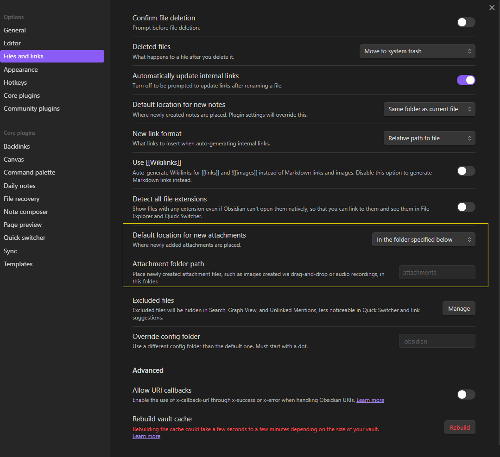

Ik raakte geïnspireerd door [deze YouTube-video van NetworkChuck](https://www.youtube.com/watch?v=dnE7c0ELEH8) en maakte mijn eerste blog. Volledig geautomatiseerd, met Obsidian. Hieronder staan zijn instructies, aangepast aan mijn situatie. Ik heb zo veel mogelijk intact gelaten, maar ik gebruik geen Hostinger: ik laat de bestanden gewoon op GitHub staan. Ook liep ik vast met de afbeeldingen, want dat werkte bij mij niet. Met wat hulp van ChatGPT vond ik de oplossing.

Omdat ik Windows gebruik, heb ik de instructies voor Linux en Mac weggelaten. In grote lijnen is het hetzelfde, alleen moet je de scripts dan aanpassen (vraag ChatGPT om hulp). Ik hoop dat je er iets aan hebt. Veel plezier!


## Obsidian

Obsidian is een app voor notities. Ik heb er nog geen mening over, maar ik zag veel positieve aanbevelingen, dus ik probeer het de komende 90 dagen uit. Download het via [obsidian.md](https://obsidian.md/).

## De opzet

Volg de instructies van Chuck:

- Maak een nieuwe map met de naam _posts_. Hier zet je je blogartikelen in.
- ...dat is alles.
- Nou ja, wacht even: zoek op waar je Obsidian-mappen staan. Klik met rechts op je map _posts_ en kies _Show in system explorer_.
- Dit pad heb je nodig in de volgende stappen.

## Hugo instellen

### Hugo installeren

#### Wat je vooraf nodig hebt

- Git installeren: [git-guides/install-git](https://github.com/git-guides/install-git)
- Go installeren: [go.dev/dl](https://go.dev/dl/)

#### Hugo zelf

Volg de installatie-instructies op [gohugo.io/installation](https://gohugo.io/installation/).

### Een nieuwe site maken

```bash
## Verify Hugo works
hugo version

## Create a new site

hugo new site websitename
cd websitename
```

### Een Hugo-thema downloaden

- Kies een thema op [themes.gohugo.io](https://themes.gohugo.io/).
- Volg de instructies van het thema om het te downloaden. De beste manier is als git-submodule.

```bash
## Initialize a git repository (Make sure you are in your Hugo website directory)

git init

## Set global username and email parameters for git

git config --global user.name "YOUR NAME"
git config --global user.email "YOURNAM@yourdomain.com"

## Install a theme (we are installing the Terminal theme here). Once downloaded it should be in your Hugo themes folder
## Find a theme ---> [https://themes.gohugo.io/](https://themes.gohugo.io/)

git submodule add -f https://github.com/panr/hugo-theme-terminal.git themes/terminal
```

### De instellingen van Hugo aanpassen

- Bij de meeste thema's zit een voorbeeldconfiguratie. Dat is meestal de beste manier om Hugo meteen goed te laten werken.
- Voor het thema _Terminal_ ziet het voorbeeld eruit zoals hieronder.
- Je past dit aan in het bestand _hugo.toml_. Open het met `notepad hugo.toml` (Windows) of `code hugo.toml` (alle systemen). Dat laatste heeft mijn voorkeur: installeer daarvoor [Visual Studio Code](https://code.visualstudio.com/download).

```toml
baseurl = "/"
languageCode = "en-us"
# Add it only if you keep the theme in the `themes` directory.
# Remove it if you use the theme as a remote Hugo Module.
theme = "terminal"
paginate = 5

[params]
  # dir name of your main content (default is `content/posts`).
  # the list of set content will show up on your index page (baseurl).
  contentTypeName = "posts"

  # if you set this to 0, only submenu trigger will be visible
  showMenuItems = 2

  # show selector to switch language
  showLanguageSelector = false

  # set theme to full screen width
  fullWidthTheme = false

  # center theme with default width
  centerTheme = false

  # if your resource directory contains an image called `cover.(jpg|png|webp)`,
  # then the file will be used as a cover automatically.
  # With this option you don't have to put the `cover` param in a front-matter.
  autoCover = true

  # set post to show the last updated
  # If you use git, you can set `enableGitInfo` to `true` and then post will automatically get the last updated
  showLastUpdated = false

  # Provide a string as a prefix for the last update date. By default, it looks like this: 2020-xx-xx [Updated: 2020-xx-xx] :: Author
  # updatedDatePrefix = "Updated"

  # whether to show a page's estimated reading time
  # readingTime = false # default

  # whether to show a table of contents
  # can be overridden in a page's front-matter
  # Toc = false # default

  # set title for the table of contents
  # can be overridden in a page's front-matter
  # TocTitle = "Table of Contents" # default

[params.twitter]
  # set Twitter handles for Twitter cards
  # see https://developer.twitter.com/en/docs/tweets/optimize-with-cards/guides/getting-started#card-and-content-attribution
  # do not include @
  creator = ""
  site = ""

[languages]
  [languages.en]
    languageName = "English"
    title = "Terminal"

    [languages.en.params]
      subtitle = "A simple, retro theme for Hugo"
      owner = ""
      keywords = ""
      copyright = ""
      menuMore = "Show more"
      readMore = "Read more"
      readOtherPosts = "Read other posts"
      newerPosts = "Newer posts"
      olderPosts = "Older posts"
      missingContentMessage = "Page not found..."
      missingBackButtonLabel = "Back to home page"
      minuteReadingTime = "min read"
      words = "words"

      [languages.en.params.logo]
        logoText = "Terminal"
        logoHomeLink = "/"

      [languages.en.menu]
        [[languages.en.menu.main]]
          identifier = "about"
          name = "About"
          url = "/about"
        [[languages.en.menu.main]]
          identifier = "showcase"
          name = "Showcase"
          url = "/showcase"
```

### Hugo testen

```bash
## Verify Hugo works with your theme by running this command

hugo server -t themename
```

## De stappen een voor een

_Let op: verderop in dit artikel staat een megascript dat alles in één keer doet._

### Obsidian synchroniseren met Hugo

Ik synchroniseer mijn Obsidian-bestanden via OneDrive. Mijn kluis (vault) staat in een aparte map, zodat ik altijd en overal bij mijn notities kan.

```powershell
robocopy "C:\Users\USER\OneDrive\MAP\SUBMAP\posts" "C:\Users\USER\Documents\YOUR-HUGO-blog\content\posts" /mir
```

### Frontmatter toevoegen

Zet bovenaan elk artikel deze gegevens:

```yaml
---
title: blogtitle
date: 2024-11-06
draft: false
tags:
  - tag1
  - tag2
---
```

### Afbeeldingen van Obsidian naar Hugo overzetten

Dit was lastig. In het begin werkte alles, tot ik de afbeeldingen in Obsidian naar één vaste map verplaatste. Dat stel je in onder _Settings_, bij _Files and links_, waar je een nieuwe map kiest.



Zo werk je veel overzichtelijker in Obsidian, maar het script van Chuck werkte daarna niet meer. Na veel proberen, en met hulp van de trouwe ChatGPT, maakte ik een nieuwe versie. Die controleert ook de omslagafbeelding.

```python
import os
import re
import shutil
import urllib.parse

# Paths for posts, attachments, and static images
posts_dir = r"C:\Users\YOURUSER\YOURBLOGDIR\hb100-blog\content\posts"
attachments_dir = r"C:\Users\YOURUSER\YOUR-OBSIDIAN-VAULT\hb100\attachments"
static_images_dir = r"C:\Users\YOURUSER\YOURBLOGDIRs\hb100-blog\static\images"

# Ensure the images folder exists
os.makedirs(static_images_dir, exist_ok=True)

# Regex to find images in the Markdown body (matches both `../attachments/` and `attachments/`)
image_regex = re.compile(r'!\[.*?\]\((?:\.\./)?attachments/([^)]*\.(?:png|jpg|jpeg|gif))\)')

# Regex to find `cover.image` in the front matter
cover_regex = re.compile(r'cover:\s*\n\s*image:\s*(?:\.\./)?attachments/([^)]*\.(?:png|jpg|jpeg|gif))')

# List files in the attachments directory for debugging
print(f"\n📂 Files in attachments directory: {os.listdir(attachments_dir)}")

# Iterate through all Markdown files
for filename in os.listdir(posts_dir):
    if filename.endswith(".md"):
        filepath = os.path.join(posts_dir, filename)

        with open(filepath, "r", encoding="utf-8") as file:
            content = file.read()

        # Find all images in the Markdown body
        matches = image_regex.findall(content)
        print(f"\n🔍 Found images in {filename}: {matches}")

        # Find cover image in the front matter
        cover_match = cover_regex.search(content)
        cover_image = cover_match.group(1) if cover_match else None
        if cover_image:
            print(f"🖼️ Found cover image: {cover_image}")

        # Process images in the Markdown body
        for image_name in matches:
            print(f"\n🌐 Image filename in Markdown: {image_name}")

            # Decode the filename for the operating system
            image_name_system = urllib.parse.unquote(image_name)
            print(f"📝 Decoded filename for OS: {image_name_system}")

            # Define source and destination paths
            image_source = os.path.join(attachments_dir, image_name_system)
            image_dest = os.path.join(static_images_dir, image_name_system)

            # Copy the image if it still exists in attachments
            if os.path.exists(image_source):
                print(f"✅ Image found in attachments: {image_source}")

                try:
                    shutil.copy2(image_source, image_dest)
                    print(f"📂 Copied to: {image_dest}")
                except Exception as e:
                    print(f"❌ Error copying image: {e}")
            else:
                print(f"⚠ Image not found in attachments: {image_source}")

            # Update Markdown to reference the correct /images/ path
            new_markdown_link = f""
            content = re.sub(rf'!\[.*?\]\((?:\.\./)?attachments/{re.escape(image_name)}\)', new_markdown_link, content)
            print(f"📝 Updated Markdown link to: {new_markdown_link}")

        # Process the cover image if it exists
        if cover_image:
            cover_image_system = urllib.parse.unquote(cover_image)
            cover_source = os.path.join(attachments_dir, cover_image_system)
            cover_dest = os.path.join(static_images_dir, cover_image_system)

            if os.path.exists(cover_source):
                print(f"✅ Cover image found: {cover_source}")

                try:
                    shutil.copy2(cover_source, cover_dest)
                    print(f"📂 Cover image copied to: {cover_dest}")
                except Exception as e:
                    print(f"❌ Error copying cover image: {e}")
            else:
                print(f"⚠ Cover image not found: {cover_source}")

            # Update the cover.image reference in the front matter
            new_cover_line = f"cover:\n  image: /images/{cover_image}"
            content = re.sub(r'cover:\s*\n\s*image:\s*(?:\.\./)?attachments/.*', new_cover_line, content)
            print(f"📝 Updated cover image reference to: {new_cover_line}")

        # Save the updated Markdown file
        with open(filepath, "w", encoding="utf-8") as file:
            file.write(content)

print("\n✅ Markdown files processed, including cover images!")
```

## Het Hugo-script en de workflow

Ik gebruik GitHub, en mijn domein loopt via Cloudflare, in plaats van Hostinger zoals in de video. Volg hiervoor [de handleiding van Hugo voor GitHub Pages](https://gohugo.io/hosting-and-deployment/hosting-on-github/), zodat het script op GitHub draait.

## Het megascript (PowerShell)

```powershell
# PowerShell Script for Windows

# Set variables for Obsidian to Hugo copy
$sourcePath = "C:\Users\path\to\obsidian\posts"
$destinationPath = "C:\Users\path\to\hugo\posts"

# Set Github repo

$myrepo = "git@github.com:USER/repo.git"

# Set error handling

$ErrorActionPreference = "Stop"

Set-StrictMode -Version Latest

# Change to the script's directory

$ScriptDir = Split-Path -Parent $MyInvocation.MyCommand.Definition

Set-Location $ScriptDir

# Check for required commands

$requiredCommands = @('git', 'hugo')

# Check for Python command (python or python3)

if (Get-Command 'python' -ErrorAction SilentlyContinue) {

    $pythonCommand = 'python'

} elseif (Get-Command 'python3' -ErrorAction SilentlyContinue) {

    $pythonCommand = 'python3'

} else {

    Write-Error "Python is not installed or not in PATH."

    exit 1

}

foreach ($cmd in $requiredCommands) {

    if (-not (Get-Command $cmd -ErrorAction SilentlyContinue)) {

        Write-Error "$cmd is not installed or not in PATH."

        exit 1

    }

}

# Step 1: Check if Git is initialized, and initialize if necessary

if (-not (Test-Path ".git")) {

    Write-Host "Initializing Git repository..."

    git init

    git remote add origin $myrepo

} else {

    Write-Host "Git repository already initialized."

    $remotes = git remote

    if (-not ($remotes -contains 'origin')) {

        Write-Host "Adding remote origin..."

        git remote add origin $myrepo

    }

}

# Step 2: Sync posts from Obsidian to Hugo content folder using Robocopy

Write-Host "Syncing posts from Obsidian..."

if (-not (Test-Path $sourcePath)) {

    Write-Error "Source path does not exist: $sourcePath"

    exit 1

}

if (-not (Test-Path $destinationPath)) {

    Write-Error "Destination path does not exist: $destinationPath"

    exit 1

}

# Use Robocopy to mirror the directories

$robocopyOptions = @('/MIR', '/Z', '/W:5', '/R:3')

$robocopyResult = robocopy $sourcePath $destinationPath @robocopyOptions

if ($LASTEXITCODE -ge 8) {

    Write-Error "Robocopy failed with exit code $LASTEXITCODE"

    exit 1

}

# Step 3: Process Markdown files with Python script to handle image links

Write-Host "Processing image links in Markdown files..."

if (-not (Test-Path "images.py")) {

    Write-Error "Python script images.py not found."

    exit 1

}

# Execute the Python script

try {

    & $pythonCommand images.py

} catch {

    Write-Error "Failed to process image links."

    exit 1

}

# Step 4: Build the Hugo site

Write-Host "Building the Hugo site..."

try {

    hugo

} catch {

    Write-Error "Hugo build failed."

    exit 1

}

# Step 5: Add changes to Git

Write-Host "Staging changes for Git..."

$hasChanges = (git status --porcelain) -ne ""

if (-not $hasChanges) {

    Write-Host "No changes to stage."

} else {

    git add .

}

# Step 6: Commit changes with a dynamic message

$commitMessage = "New Blog Post on $(Get-Date -Format 'yyyy-MM-dd HH:mm:ss')"

$hasStagedChanges = (git diff --cached --name-only) -ne ""

if (-not $hasStagedChanges) {

    Write-Host "No changes to commit."

} else {

    Write-Host "Committing changes..."

    git commit -m "$commitMessage"

}

# Step 7: Push all changes to the main branch

Write-Host "Deploying to GitHub Master..."

try {

    git push origin master

} catch {

    Write-Error "Failed to push to Master branch."

    exit 1

}

# Step 8: Push the public folder to the hostinger branch using subtree split and force push

Write-Host "Deploying to GitHub Hostinger..."

# Check if the temporary branch exists and delete it

$branchExists = git branch --list "hostinger-deploy"

if ($branchExists) {

    git branch -D hostinger-deploy

}

# Perform subtree split

try {

    git subtree split --prefix public -b hostinger-deploy

} catch {

    Write-Error "Subtree split failed."

    exit 1

}

# Push to hostinger branch with force

try {

    git push origin hostinger-deploy:hostinger --force

} catch {

    Write-Error "Failed to push to hostinger branch."

    git branch -D hostinger-deploy

    exit 1

}

# Delete the temporary branch

git branch -D hostinger-deploy

git add -A

git commit -m "Create hugo.yaml"

git push

Write-Host "All done! Site synced, processed, committed, built, and deployed."
```

Klaar!

Vanaf nu blog je gewoon in Obsidian. Ben je klaar met schrijven, dan draai je het megascript.

Voor mij is dat: open PowerShell en voer `.\updateblog.ps1` uit in de map `\Documents\hb100-blog`.
